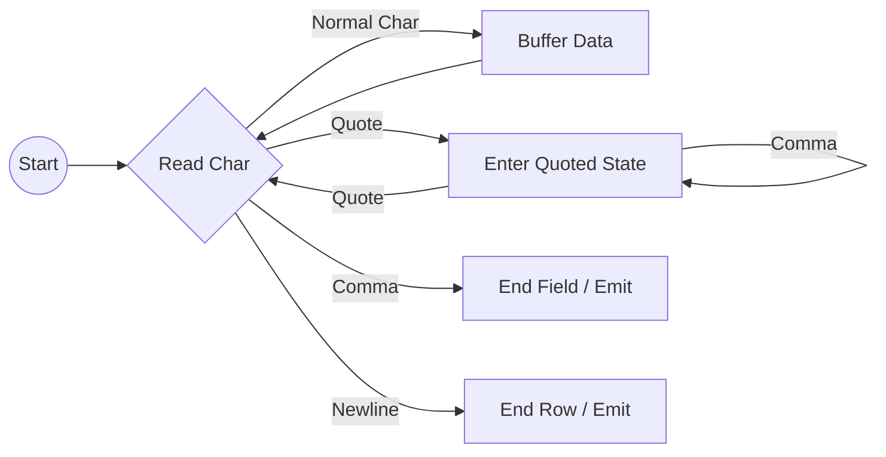
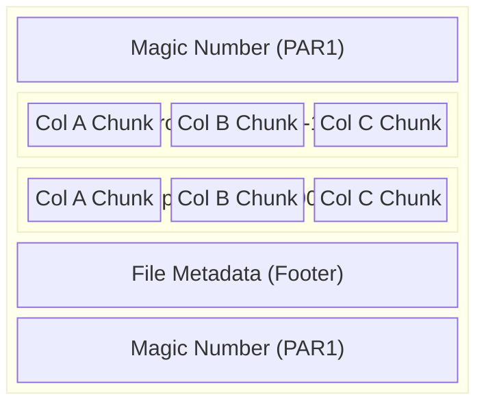

If module 1 was about the road (Disk) and module 2 was about the vehicle architecture (Row vs. Column), this module is about the shipping container itself.

You have likely spent your career treating files as abstract buckets of data. You run `pd.read_csv()` or `spark.read.json()` and data appears. But to the database engine, a file format is a specific arrangement of bytes that dictates how hard the CPU has to work to turn electricity on a disk into integers in a register.

We begin with the formats that humans love and machines hate.

## 3.1 Row-Based Files (CSV & JSON)
The vast majority of the world's data is exchanged in text formats—Comma-Separated Values (CSV) and JavaScript Object Notation (JSON). They are the "cockroaches" of data engineering: primitive, ugly, and impossible to kill.

Why do we use them? Because they are human-readable. You can open them in Notepad. Why do we hate them? Because **human-readability is the enemy of machine-efficiency**.

### The Parsing Tax: Text is Expensive
When you ask the database to read a CSV file, you aren't asking it to simply "load data." You are asking it to perform a complex translation of every single byte.

In a binary format (which we will cover next), an integer is stored as 4 bytes. To read it, the CPU copies those 4 bytes directly from the disk buffer into a register. It is a raw memory move (`memcpy`). Fast.

In a CSV, the number `12,345` is stored as a string of characters: `'1'`, `'2'`, `','`, `'3'`, `'4'`, `'5'`. To read this, the engine must:

1. **Scan** byte-by-byte to find the delimiter (the comma).
2. **Handle** edge cases (is the comma inside quotes?).
3. **Convert** the characters `'1'`, `'2'`, `'3'`, `'4'`, and `'5'` from ASCII/UTF-8 code points into a binary integer.

This process is CPU-bound. You are burning cycles just to understand  what the data is before you can even query it.

!!! failure "The Cost of `atoi`"
	
    In C (the language of most database engines), converting a string to an integer uses a function like `atoi` (ASCII to integer).

    To convert `"123"`, the CPU does roughly this:

    $$
    \text{accumulator } = (1 \times 100) + (2 \times 10) + (1 \times 3)
    $$
    
    That is multiplication and addition for *every single number* in your dataset. If you are scanning a billion rows, you are doing billions of math operations just to read the file. That is latency.

### The State Machine Nightmare
From a "Mechanic's Perspective," reading a CSV is not a linear read; it is a **State Machine**. The parser must maintain a state for every character it encounters.



Every arrow in that diagram represents an `IF` statement in the engine's source code. `IF` statements cause **Branch Misprediction** in the CPU, disrupting the instruction pipeline. CSVs force the CPU to stutter-step through your data.

### JSON: The "Packing Peanut" Problem
If CSV is CPU-heavy, JSON is storage-heavy. JSON is a row-based format that repeats the schema for every single record.

Consider this data:

```json
{"user_id": 101, "event_type": "click", "timestamp": 1678886400}
{"user_id": 102, "event_type": "view", "timestamp": 1678886405}
```

Notice that the strings `"user_id"`, `"event_type"`, and `"timestamp"` are repeated for every row. If you have 1 million rows, you are storing the word `"user_id"` 1 million times.

I call this the **Packing Peanut Ratio**: How much of your I/O is actual product (data), and how much is just Styrofoam (metadata)? In JSON, the Styrofoam often outweighs the product. You are paying bandwidth costs to move column names across the network.

### The Myth of "Schema-on-Read"
Modern data lakes often tout "Schema-on-Read" as a feature. It allows you to dump files into an S3 bucket without defining a table first. It feels agile.

To the database engine, "Schema-on-Read" is a disaster.

When the engine reads a CSV or JSON file without a predefined schema, it has to **infer** the data types. It usually does this by scanning the first few rows (the "header" or a sample).

!!! warning "The Inference Trap"

    **Scenario**: The engine scans the first 1,000 rows of your CSV. The `zip_code` column contains values like `90210` and `10001`. The engine concludes, "This is an integer."
 
    **The Crash**: On row 50,000, it encounters a Canadian postal code: `K1A 001`.
    **The Result**: Type mismatch error. The query fails after running for 10 minutes.
    Or, worse, it silently coerces the data, stripping leading zeros from zip codes (turning `02138` into `2138`), effectively corrupting your data.

Schema-on-Read forces the engine to be defensive. It cannot optimize storage or memory allocation because it doesn't truly know what's coming next. It has to allocate generic string buffers instead of tight integer arrays.

### No Random Access (The Seek Problem)
Perhaps the most critical flaw of row-based text files is the lack of **seekability**.

In a database page (as discussed in module 1), the engine knows exactly where Row #500 starts because rows are fixed-width or managed by an offset table.

In a CSV, rows are variable length. Row 1 might be 50 bytes; Row 2 might be 500 bytes (due to a long text comment).

If you want to read Row #1,000,000:

1. You cannot calculate its position mathematically.
2. You must read and parse Rows #1 through #999,999 to find the newline characters.

This makes **Parallelism** incredibly difficult. You cannot easily tell Worker A to "process the second half of the file" because Worker A doesn't know where the second half begins without scanning from the start.

!!! quote "The Engineer's Rule of Thumb"

    Use CSV and JSON for **interchange** (moving data between systems), not for **storage** (querying data). If you are querying a 100 GB CSV file in a Data Lake, you are fighting physics. You are burning CPU to parse commas and newlines instead of executing your logic.

## 3.2 Columnar Formats (Parquet & ORC)
If CSV is a loose pile of paper, **Parquet** (and its cousin ORC) is a perfectly organized filing cabinet.

In module 2, we discussed the *logical* concept of Column Stores. Now, we look at the *physical* implementation. Parquet is the industry standard for Data Lakes not because it is "modern," but because it respects the physics of the disk drive. It is a binary, self-describing, columnar format designed to minimize I/O.

When you run a query against a Parquet file, the engine does not start reading at the beginning. It jumps to the end.

### The Anatomy of a Parquet File
A Parquet file is not a continuous stream of data. It is a hierarchical structure designed to let the engine read as little as possible.

The file is sliced horizontally into **Row Groups**, and then vertically into **Column Chunks**.



#### 1. The Footer (The Manifest)
This is the most "anti-CSV" feature of Parquet. The metadata lives at the end of the file.

Why? Because when a writer (like Spark or Snowflake) is generating the file, it writes the data sequentially. It doesn't know where the columns will end until it finishes writing them. Once the data is written, the writer notes the start/end byte offsets of every block and writes that "map" to the footer.

When a reader opens a Parquet file, it performs a **seek** to the end of the file, reads the footer length, and parses the metadata. This footer tells the engine exactly which byte ranges on the disk contain the data for `Column A`.

**The Result**: If your query only asks for `Column A`, the engine reads the footer, calculates the offset, and seeks directly to `Column A`. It never touches the bytes for `Column B` or `Column C`.

#### 2. Row Groups (Horizontal Partitioning)
Parquet divides the rows into block called Row Groups (usually containing anywhere from 10,000 to 1 million rows).

This prevents the "Memory Explosion" problem. If a file has 1 billion rows, the engine doesn't have to load the entire column into RAM. It can process one Row Group (buffer size ~128 MB), finish it, and discard it before loading the next.

#### 3. Column Chunks and Pages
Inside a Row Group, the data for a single column is stored contiguously in a **Column Chunk**. Inside that chunk, data is further split into **Pages**. The page is the atomic unit of compression and encoding.

### The Power of Metadata: Statistics
The real "mechanic's trick" inside Parquet is that it knows what it holds before it opens the box.

In the footer (and typically in page headers), Parquet stores  **Statistics** for every column chunk:

- **Min Value**.
- **Max Value**.
- **Null Count**.

This enables a powerful technique called **predicate pushdown** (or data skipping).

!!! example "The Skipping Scenario"

    Imagine you have a 100 GB Parquet file of sales data sorted by `date`. You run this query:

    ```sql
    SELECT SUM(amount) FROM sales WHERE date = '2023-12-25'
    ```

    **Without Stats (CSV)**: The engine must read all 100 GB to find the rows for Christmas Day.
    **With Stats (Parquet)**: The engine reads the footer. It looks at the metadata for **Row Group 1**:

    > *Row Group 1 (Column: Date) -> Min: '2023-01-01', Max: '2023-01-31'*
    
    The engine asks, "Is Christmas inside January?" **No.**
    The engine **skips** the entire Row Group. It doesn't issue a read request to the disk. It moves to the next metadata block. It effectively turns a 100 GB I/O operation into a few kilobytes of metadata lookups.

### Schema Evolution (The Anti-Fragile Container)
Unlike CSV, Parquet is **self-describing**. The schema (column names, data types) is embedded in the file footer.

This solves the "Schema-on-Read" nightmare we discussed in the last section.

- **Type Safety**: The file explicitly states "Column `zip_code` is a String," so the engine won't accidentally treat `02138` as the integer `2138`.
- **Evolution**: If you add a column to your table, new Parquet files will have the new column in their footer. Old Parquet files won't. The engine can merge these schemas gracefully (filling `NULL` for the missing column in old files) because the file structure is strictly defined.

### ORC (Optimized  Row Columnar)
While Parquet is the darling of the Spark ecosystem, **ORC** is the standard for the Hive and Presto/Trino ecosystems. They are functionally very similar—both are columnar, binary, and compression-heavy.

The main architectural difference is how they handle indexes:

- **Parquet** is optimized for nested data (complex types like JSON-inside-columns) due to its origin at Google (Dremel).
- **ORC** is often more aggressive with compression and has lightweight indexes (Bloom Filters) built into the file stripes by default, making it slightly faster for specific "needle-in-a-haystack" lookups in Hive.   

## 3.3 Serialization (Avro & Protobuf)
We have covered the formats that humans read (CSV/JSON) and the formats that Data Warehouses read (Parquet/ORC). Now we must address the formats that applications use to talk to each other.

IF Parquet is a heavy filing cabinet designed to sit still in a warehouse. **Avro** and **Protobuf** are sealed envelopes zipping through pneumatic tubes. They are designed for **Streaming** and **RPC** (Remote Procedure Calls).

In a distributed system (like Kafka or gRPC), latency is king. You cannot afford to buffer 10,000 rows to build a Parquet row group. You need to send one event immediately. And you cannot afford the CPU tax of parsing JSON string-by-string.

### The Problem with JSON in Streams
In high-throughput systems (e.g., tracking every click on Netflix), sending JSON is wasteful. Recall the **Packing Peanut Ratio**: Sending `{"timestamp": 16788}` repeatedly wastes bandwidth.

Binary serialization formats like Avro and Protobuf solve this by surgically separating the **Schema** (the instructions) from the **Data** (the payload).

### Apache Avro: The Hadoop Heir
Avro is a **Row-Based Binary** format. Like CSV, it stores data one record at a time (perfect for streaming). Like Parquet, it is binary and compressed (efficient).

The genius of Avro is how it handles the schema.

1. **The Schema (JSON)**: Defines what the data looks like (`{"name": "user", "type": "string"}`).
2. **The Payload (Binary)**: A dense stream of bytes without field names.

If you look at the raw binary of an Avro record, you won't see `"user_id"`. You will just see the bytes for the value `101`. To read it, you must have the schema. The schema acts as a decoder ring.

### The Schema Registry Patterns
In systems like Kafka, Avro is often used with a **Schema Registry**.

1. **Producer**: Wants to send a message. It checks the Registry, "I am sending User data." The Registry says: "That is Schema ID #5."
2. **Transmission**: The Producer sends just the ID (`#5`) and the raw binary data. It does **not** send the column names.
3. **Consumer**: Receives ID `#5`. it asks the Registry. "Give me the decoder ring for #5." It then overlays that schema onto the binary to read that data.

This reduces the payload size dramatically. You aren't sending field names over the wire; you are sending a tiny ID.

### Protocol Buffers (Protobuf): The Speed Demon
If Avro is designed for Data Ecosystems (Hadoop/Kafka), **Protobuf** is designed for Service Ecosystem (Microservices/gRPC). It was invented by Google to replace  XML.

Protobuf relies on **Code Generation**.

You write a `.proto` file defining your data:

```proto
message User {
  required int32 id = 1;
  required string name = 2;
}
```

You then run a compiler (`protoc`) that generates a C++, Java, or Python class. This class contains highly optimized code to serialize that object into bytes.

**Why is it faster?** In Avro/JSON, the parser is often generic. In Protobuf, the "parser" is hard-coded for your specific object. The CPU instructions are pre-baked to write specific bytes to specific offsets. It is arguably the fastest way to turn an object in memory into a stream of bytes on the wire.

### Why Not Parquet for Streaming?
Students often ask, "If Parquet is so great, why don't we use it for Kafka?"

This comes back to the **Mechanic's Perspective** on buffering.

- **Columnar (Parquet)**: To write a column chunk efficiently, you need to buffer a lot of data (e.g., 10,000 values) so you can compress them together. If you write one row at a time in Parquet, you destroy the compression and create millions of tiny files (Small Files Problem).
- **Row-Based (Avro/Protobuf)**: You can serialize and flush a single record instantly.

## Quiz

<quiz>
Why is parsing a CSV file described as a 'State Machine' nightmare for the CPU?
- [ ] The CSV format requires the CPU to load the entire file into RAM before processing.
- [ ] The CPU must compress the data in real-time while reading it.
- [x] The CPU must scan byte-by-byte to handle delimiters and edge cases, causing branch misprediction.
- [ ] CSV files are always stored on slower parts of the disk drive.

</quiz>

<quiz>
What is the 'Packing Peanut' problem associated with JSON files?
- [ ] The difficulty of packing multiple JSON objects into a single array.
- [ ] The padding of whitespace characters added to make the file human-readable.
- [x] The repetitive storage of field names (metadata) for every single record.
- [ ] The inability to compress JSON files effectively.

</quiz>

<quiz>
In a Parquet file, where does the engine look to determine if it can skip a specific Row Group?
- [ ] The first row of each block.
- [x] The file footer.
- [ ] An external index file like .idx.
- [ ] The file header.

</quiz>

<quiz>
Why is 'Schema-on-Read' generally considered risky for high-performance data engineering?
- [x] The engine must infer data types, leading to potential corruption or type mismatches.
- [ ] It prevents the use of compression algorithms.
- [ ] It requires the user to manually define the table structure before loading data.
- [ ] It forces the database to lock the file for writing.

</quiz>

<quiz>
Which feature of Parquet files allows an engine to ignore 99% of a 100 GB file when searching for a specific date?
- [ ] Dictionary encoding.
- [x] Min/Max statistics (Predicate Pushdown).
- [ ] Hash Partitioning.
- [ ] Run-Length Encoding

</quiz>

<quiz>
Why are row-based binary formats like Avro preferred over Parquet for streaming systems (e.g., Kafka)?
- [ ] They provide better compression ratios than columnar formats.
- [ ] They do not require a schema definition.
- [ ] They are human-readable.
- [x] They allow individual records to be written and flushed immediately without buffering.

</quiz>

<quiz>
What is the primary advantage of Protocol Buffers (protobuf) regarding serialization speed?
- [x] It uses code generation to create hard-coded parsers optimized for specific objects.
- [ ] It compresses data using the GZIP algorithm by default.
- [ ] It includes the full schema in every message sent.
- [ ] It stores data in plain text XML format.

</quiz>

<quiz>
Why is random access (seeking to Row #1,000,000) difficult in a CSV file?
- [ ] CSV files are encrypted by default.
- [ ] Operating systems do not support seeking in text files.
- [x] Rows are variable length, so the engine cannot calculate the offset mathematically.
- [ ] The file header is too large to skip.

</quiz>

<quiz>
In the 'Hierarchy of Speed' (implied by the physics discussion), which operation is the fastest for the CPU?
- [ ] Converting an ASCII to an integer.
- [ ] Scanning for a newline character.
- [ ] Parsing a JSON key.
- [x] Copying raw binary bytes (`memcpy`).

</quiz>

<quiz>
How does the 'Schema Registry' pattern improve efficiency for Avro in systems like Kafka?
- [ ] It converts the data into a columnar format automatically.
- [x] It replaces the full schema in the message with a small ID.
- [ ] It guarantees that no data is ever lost.
- [ ] It encrypts the data for security.

</quiz>

<!-- mkdocs-quiz results -->

## Lab
Please complete module 3's lab in the companion GitHub repository.