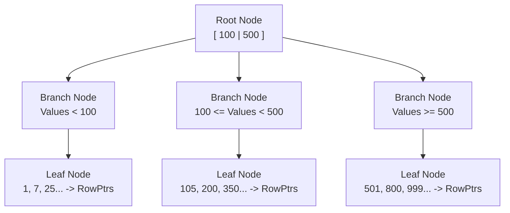

We have spent the last three chapters discussing how to store data efficiently. But storage is useless if retrieval takes forever.

If you have a table with 1 billion rows, and you run `SELECT * FROM users WHERE id = 98273`, you do not want the engine to read 1 billion rows to find one. That is called a **Full Table Scan**, and in the world of database performance, it is the equivalent of reading every book in the Library of Congress just to find "Harry Potter."

We need a system to skip the noise. We need an **index**.

## 4.1 The Sorted Structure
The B-Tree (and its variant, the B+ Tree) is the most enduring data structure in computer science. Invented in 1970, it still powers almost every relational database today.

Why? Because it is perfectly  tuned to the physics of the spinning disk.

To understand a B-Tree, you don't need to understand computer science. You just need to understand a **Phone Book**.

Imagine a phone book with 1,000 pages.

- **Scenario A (Unsorted)**: If the names are printed in random order, and you wanted to find "Smith," you would have to scan every single name from Page 1 to Page 1,000.
- **Scenario B (Sorted)**: Because the names are sorted alphabetically, you don't scan. You **flip**.

    1. You open the book to the middle (page 500). You see "Miller."
    2. "Smith" comes after "Miller." You know the name is in the second half. You have just discarded 500 pages (50% of the data) with one action.
    3. You split the second half. Page 750. You see "Williams."
    4. "Smith" is before "Williams." You discard pages 751-1000.

This is **Binary Search**. It turns a linear problem ($O(N)$) into a logarithmic problem ($O(\log{N})$).

### The Anatomy of the Tree
A database index is essentially a separate file that stores a specific column (like `user_id`) in a sorted order, along with a pointer to the actual row on the disk.

But it's not just a flat list. If the index list were just a flat file, you'd still have to seek around a lot. Instead, it is hierarchical.

There are three types of blocks (nodes) in this structure:

1. **The Root Node**: The entry point. The map to the maps. It contains ranges (e.g., "Values 0-500 go left, 501-1000 go right").
2. **Branch Nodes**: Intermediate signposts. They don't contain data; they just point you closer to your destination.
3. **Leaf Nodes**: The bottom layer. This is where the actual values (keys) live. In a standard B-Tree index, the leaf node contains the key (`user_id = 101`) and a **Pointer** (Row ID) to the physical location of the full row on the disk heap.

### The Physics: Why "B" Matters
The "B" in B-Tree stands for **Balanced** (some say Boeing or Bayer, but for us, it's Balanced).

The magic of the B-Tree is not just that it's sorted, but that it is **Wide and Short**.

- **Binary Trees (in memory)**: Often deep and narrow. To find a value, you might traverse 50 pointers.
- **B-Trees (on disk)**: Very wide. A single node might have 500 children.

**Why? The 8 KB Page Rule**. Remember module 1, the atomic unit of disk I/O is a **Page**. If you are going to pay the latency cost to read a node from the disk, you want to cram as much information into that read as possible.

You don't want a node to hold just two numbers (Left/Right). You want an 8 KB node to hold **hundreds** of numbers. By packing hundreds of branch pointers into a single 8 KB page, the tree becomes very short.

A B-Tree with millions of rows might only be **3 levels deep**.

- **Hop 1 (Root)**: Read 8 KB. "Go to branch 5."
- **Hop 2 (Branch)**: Read 8 KB. "Go to leaf 42."
- **Hop 3 (Leaf)**: Read 8 KB. "Here is the Row ID."

**Total Cost**: 3 Disk Seeks. **Alternative (Scan)**: 100,000 Disk Seeks.

### The "Doubly Linked" Secret
In modern database implementations (like the B+ Tree), the Leaf Nodes are not islands. They are connected to their neighbors.

Leaf A has a pointer to Leaf B, which points to Leaf C.

**Why is this brilliant?** It makes **Range Queries** incredibly fast.

Query: `SELECT * FROM sales WHERE data BETWEEN '2023-01-01' AND '2023-01-05'`

1. **Tree Traversal**: The engine uses the tree to find the *first* date ('2023-01-01').
2. **Linked List Scan**: Once it lands on that Leaf Node, it stops looking at the tree. It just follows the "next page" pointer at the bottom of the leaf to read forward until it hits '2023-01-05'.

It combines the precision of a seek with the speed of a sequential scan.

## 4.2 Logarithmic Time ($O(\log{N})$)
In "The Mechanic's Perspective," we don't care about Big O notation for academic proofs. We care about it because it predicts **billable hours**. It tells us how the system behaves as it grows.

Most systems in the physical world scale **linearly** ($O(N)$). If you have to dig 1 ditch, it takes 1 hour. Digging 10 ditches takes 10 hours. Digging 1 billion ditches takes a lifetime.

A B-Tree breaks this rule. It scales **logarithmically**.

### The Power of Halving (or Splitting by 500)
Logarithmic time essentially means, "Every time we double the data, we only add **one** extra step to the work."

Let's visualize the "Phone Book" analogy from the previous section mathematically. Imagine a binary search (base 2).

- **1,000 Rows**: Takes ~10 hops.
- **1,000,000 Rows**: Takes ~20 hops.
- **1,000,000,000 Rows**: Takes ~30 hops.

**Stop and stare at that**. You increased the data volume by **1,000,000x**(from 1 K to 1 B), but the work only increased by **3x** (from 10 hops to 30).

This is why databases can handle petabytes of data. The cost of retrieval decouples from the volume of storage.

### The Fan-Out Factor
In a real database B-Tree, it's even better than base 2. Remember the "Wide Node" concept? A single 8 KB page can store hundreds of pointers. Let's assume a "Fan-Out" of 500 (each node has 500 children).

The math changes to $\log_500{N}$.

- **Level 1 (Root)**: Holds 500 pointers. Covers 500 rows.
- **Level 2**: 500 $\times$ 500 = 250,000 rows.
- **Level 3**: 250,000 $\times$ 500 = 125,000,000 rows.
- **Level 4**: 125,000,000 $\times$ 500 = 62,500,000,000 (62 billion) rows.

**The Reality Check**: To find a single row in a table of **62 billion rows**, the engine only needs to read **4 pages** (4 levels deep).

- 4 Reads $\times$ 8 KB = 32 KB of I/O.
- If your disk reads at 100 MB/s, the operation takes **microseconds**.

### The "Cache Hit" Bonus
It gets faster.

Because the **Root Node** and the **Level 2 Branches** are accessed by every single query, they are almost always "hot." The database engine keeps them pinned in RAM (the buffer pool).

So, for those first 2 or 3 hops, you aren't even touching the disk. You are reading from RAM (nanoseconds). Usually, only the final hop (the Leaf Node) requires a physical disk seek.

### Why "Scanning" Still Exists
If seeking is so fast ($O(\log{N})$, why do we ever do full table scans ($O(N)$)?

**Physics**. The mechanic knows that random I/O is hard, and sequential I/O is easy.

- **Seek (Index)**: Low CPU, High Latency per read (Magnet arm has to move).
- **Scan (Table)**: High CPU, Low Latency per read (Magnet arm stays still and streams).

There is a **Tipping Point** (often around 5-10% of the table).

If your query returns 50% of the table (e.g., `SELECT * FROM users WHERE gender = 'F'`), using the index is actually slower. Why? Because jumping around the disk 500 million times (Random I/O) is slower than just reading the whole disk once linearly (Sequential I/O).

The Optimizer does this math. It calculates:

$$
Cost_{Index} = (\text{Row Count } \times \text{ Seek Cost})
$$

vs.

$$
Cost_{Scan} = (\text{Total Pages } \times \text{ Read Cost})
$$

If the index cost is higher, it abandons the B-Tree and grabs the firehose.

## 4.3 The Clustered Index
This is the single most important physical design decision you will make for a table.

Up until now, we have described an index as a separate object—a "map" that points to the "treasure" (the row).

- **The Map**: The B-Tree file.
- **The Treasure**: The Heap file (the table data, sorted in random order).

This standard approach is called a **Non-Clustered Index**. It requires two steps:

1. Search the B-Tree to get the Row ID.
2. Jump to the Heap to fetch the columns.

But what if we organized the treasure itself?

### The Dictionary Definition
A **Clustered Index** is not a separate object. **It is the table**.

When you define a Clustered Index on a column (usually the Primary Key, like `ID`), the database engine physically rearranges the rows on the disk to match that order.

Think of it like a **Dictionary**.

- In a Dictionary, the words aren't just listed in the back; the book *itself* is sorted A-Z.
- The definitions (the data columns) are right there next to the word (the key).

In a Clustered Index, the **Leaf Nodes** of the B-Tree do not contain pointers. They contain the **actual data pages**.

### The Performance Impact
Why does this matter? **Locality**.

#### 1. The "Double Dip" Elimination
In a Non-Clustered Index, finding a row costs:

- 3 reads in the index (Tree Traversal).
- +1 read in the Heap (Fetching the row).

In a Clustered Index, finding a row costs:

- 3 reads in the index.
- **Stop**. You are done. The data is already in your hand because the Leaf Node *is* the data page.

You save 1 I/O operation per lookup. That sounds small, but across a billion queries, it is massive.

#### 2. The Range Query Superpower
This is the killer feature.

Imagine you want `SELECT * FROM orders WHERE date BETWEEN 'Jan 1' AND 'Jan 31'`.

- **Heap (Non-Clustered)**: The rows for January are scattered randomly across the disk. Jan 1 is on Page 50. Jan 2 is on Page 9000. Jan 3 is on Page 12. The drive head has to thrash back and forth (random I/O) to pick them up one by one.
- **Clustered Index (on Date)**: The Engine finds the first row for 'Jan  1.' Because the table is physically sorted, it knows that 'Jan 2' and 'Jan 3' are on the *same page* or the *immediate next page*. It can just stream the data sequentially.

!!! success "The Mechanic's Tip"

    If you have a table that is almost always queried by time (e.g., `logs`, `events`, `transactions`), you should strongly consider Clustering on the `timestamp` or an auto-incrementing `ID`. It ensures that recent data sits physically close together on the disk.

### The Cost of Clustering
There is no free lunch in physics. If sorting makes reading faster, it makes writing slower.

**The "Page Split" Problem**: In a Heap (unsorted), adding a new row is fast. The engine just finds the first empty spot at the end of the file and dumps the data there. $O(1)$.

In a Clustered Index, the data *must stay* sorted. If you insert `ID = 5` into a page that holds IDs 1-10, and that page is full:

1. The engine has to **split** the page in half.
2. It  moves half the rows to a new page.
3. It updates the B-Tree pointers.
4. It inserts `ID = 5`.

This is **Write Amplification**. One innocent `INSERT` can trigger a cascade of disk I/O.

## Quiz

<quiz>
In the 'Phone Book' analogy for B-Trees, what search method allows you to discard 50% of the data with a single action?
- [ ] Random sampling.
- [ ] Hash mapping.
- [x] Binary search.
- [ ] Linear scan.

</quiz>

<quiz>
Why is a B-Tree designed to be 'Wide and Short' rather than deep like a binary tree in memory?
- [ ] To make it easier for humans to read the index structure.
- [ ] To allow for faster sorting of the data in memory.
- [x] To maximize the utility of each 8 KB disk page read.
- [ ] To reduce the amount of RAM required by the database.

</quiz>

<quiz>
What is the Big O time complexity for finding a row using a B-Tree index?
- [ ] $O(n^2)$
- [ ] $O(n)$
- [x] $O(\log{N})$
- [ ] $O(1)$

</quiz>

<quiz>
If you increase a dataset from 1 billion rows to 1 trillion rows (1000x growth), how does the B-Tree search cost change?
- [ ] It stays exactly the same.
- [ ] It decreases.
- [ ] It increases by 1000x.
- [x] It increases slightly (e.g., from ~3 to ~4 hops).

</quiz>

<quiz>
What is the critical difference between a Clustered Index and a Non-Clustered Index?
- [ ] You can have multiple Clustered Indexes on one table.
- [x] A Clustered Index sorts the actual data rows on the disk.
- [ ] A Non-Clustered Index stores the data in the leaf nodes.
- [ ] A Clustered Index is always faster for writing data.

</quiz>

<quiz>
Why is Clustered Index superior for Range Queries (e.g., `BETWEEN 'Jan 1' A ND 'Jan 31'`)?
- [ ] It compresses the date column more efficiently.
- [ ] It caches the entire range in RAM automatically.
- [x] The relevant rows are physically adjacent on the disk.
- [ ] It uses a Hash Map instead of a B-Tree.

</quiz>

<quiz>
What is 'Write Amplification' in the context of a Clustered Index?
- [x] A single insert causing a Page Split and moving many rows to new pages.
- [ ] The log file is growing larger than the data file.
- [ ] The text in the index is larger than the original data.
- [ ] The database is writing the data to multiple hard drives for redundancy.

</quiz>

<quiz>
Why does the database optimizer sometimes choose a Full Table Scan over using an index?
- [x] If the query returns a large percentage (e.g., > 10%) of the table.
- [ ] If the table has fewer than 100 rows.
- [ ] If the index is corrupted.
- [ ] If the query uses a `SELECT *`  statement.

</quiz>

<quiz>
What is the 'Leaf Node' responsible for in a standard Non-Clustered B-Tree?
- [ ] Storing the table metadata.
- [ ] Holding the entire row of data.
- [ ] Deciding whether to go Left or Right.
- [x] Holding the key and a pointer to the Row ID.

</quiz>

<quiz>
Why are Root and Branch nodes almost always in RAM (Buffer Pool)?
- [ ] They are smaller than Leaf nodes.
- [ ] They contain the most important data.
- [ ] They are pinned there manually by the administrator.
- [x] They are accessed by every single query using that index.

</quiz>

<!-- mkdocs-quiz results -->

## Lab
Please complete module 4's lab in the companion GitHub repository.