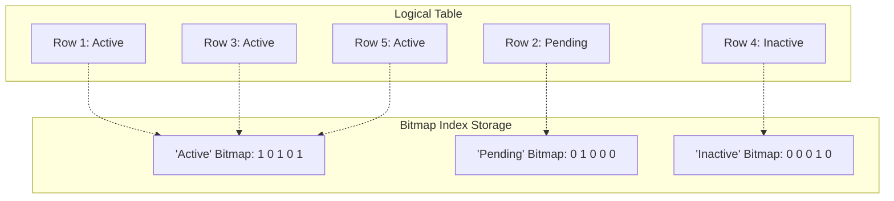
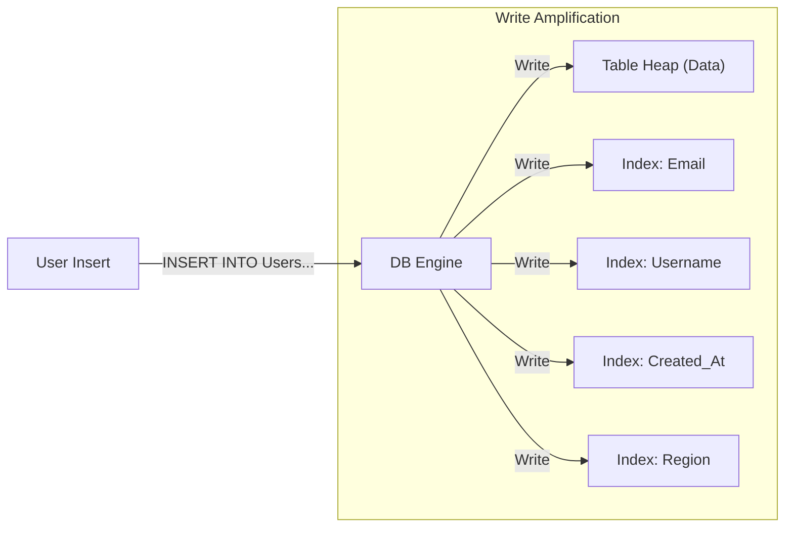

In the previous module, we spent a lot of time admiring the **B-Tree**. It is the Swiss Army Knife of indexing—reliable, balanced, and excellent at finding unique identifiers. It handles high-cardinality data (like `User IDs` or `Transaction Numbers`) with grace.

But imagine using a phone book (our B-Tree analogy) in a town where everyone is named "Smith." If you look up "Smith," the index points you to page 1. Then page 2. Then page 3.  The  index stops being a shortcut and starts being a burden. You are jumping back and forth between the index and the pages so often that you might as well just read the whole book from start to finish.

This is where the B-Tree fails. When the **Cardinality** (the number of unique values) is low—think `Gender`, `Status`, or `Is_Active`—the B-Tree is too heavy. It's like using a dump truck to carry a single pebble.

For these situations, we need a lighter tool. We need the **Bitmap Index**.

## 5.1 Bitmap Indexes: The Power of the Bitmask
A Bitmap index fundamentally changes how we visualize the data. Instead of a tree structure that points to row locations, a Bitmap Index transforms your columns into a series of **Bitstrings** (arrays of 0s and 1s).

Let's look at a table of Users with a low-cardinality column: `Status`.

| RowID | Status |
|:---|:---|
| 1 | Active |
| 2 | Pending |
| 3 | Active |
| 4 | Inactive |
| 5 | Active |

A B-Tree would try to sort these text strings. A Bitmap Index, however, creates a distinct "map" for every possible value in that column. It asks a simple binary question for every row: *is this you?*

The database physically stores these maps as streams of bits. If we visualize it, it looks like a matrix:



Notice the mapping. The **1st**, **3rd**, and **5th** bits in the "Active" map are turned on (`1`). This corresponds directly to the **1st**, **3rd**, and **5th** rows in the table. This is incredibly space-efficient. We aren't storing the string "Active" three times; we are storing three bits.

### The Physics: Why It's Fast
You might be thinking, "Okay, it's smaller. But why is it faster?"

The speed comes from the CPU. CPUs are addicted to **Bitwise Operations**. They can process standard logical operations (AND, OR, XOR, NOT) on massive streams of bits in a single clock cycle.

Let's say you run this query:

```sql
SELECT * FROM Users
WHERE Status = 'Active'
    AND Is_Premium = 'True';
```

If you used B-Trees, the engine would traverse the `Status` tree to find a list of Row IDs, then traverse the `Is_Premium` tree to find another list, and then try to intersect them. Expensive.

With Bitmap Indexes, the engine doesn't "search" anything. It just grabs the two bitstrings and smashes them together using a hardware-level **Bitwise AND**.

**The Hardware Logic**:

- **Active Bitmap**: `1 0 1 0 1`.
- **Premium Bitmap**: `0 0 1 1 1`.
- **Result (AND)**: `0 0 1 0 1`.

The result tells the engine instantly, "Fetch Row 3 and 5." There is no tree traversal. There is no guessing. It is pure boolean algebra executing at the speed of electricity.

!!! success "Compression Bonus"

    Because these bitmaps often contain long stretches of zeros (e.g., in a sparse column), they compress incredibly well using algorithms like **Run-Length Encoding (RLE)**. If you have 1,000 zeros in a row, the database doesn't write `0` a thousand times; it writes `1000x0`. This is why columnar databases feel so "magical" with large datasets—they are essentially using compressed bitmaps for everything.

### The Trade-Off: The Concurrency Killer
If Bitmap Indexes are so fast and small, why don't we use them for everything? Why does Postgres default to B-Trees?

The answer lies in **locking**.

When you update a B-Tree, you are usually only locking a specific leaf node or a row. You can update "Smith" while someone else updates "James" without much conflict.

However, a Bitmap Index is a single, continuous stream of bits. If you want to change Row 2 from "Pending" to "Active," the database has to physically modify the "Pending" bitmap and the "Active" bitmap.

In many older implementations, to keep the bitmap coherent, the database has to **lock the entire bitmap segment**.

!!! danger "The Write Penalty"

    If you try to use a Bitmap Index on a heavy OLTP system (lots of inserts/updates), you will see massive **Lock Contention**.

    Imagine 50 users trying to update their status at once. Because they are all trying to flip bits in the same encoded string, they have to wait in line.

    **Rule of Thumb**: Bitmap Indexes are for **Reading** (Data Warehouses/OLAP), not for **Writing** (Transactional Apps/OLTP).

## 5.2 The Cost of Indexes: There Is No Free Lunch
A junior engineer discovers that adding an index to the `email` column made their query go from 5 seconds to 5 milliseconds. Elated by this discovery, they proceed to index the `first_name` column. Then `last_name`. Then `created_at`. Then `updated_at`.

They think they are optimizing the database. In reality, they are slowly killing it.

This leads us to the most important law of database physics: **Indexes speed up Reads, but they slow down Writes**.

### The Illusion of "Metadata"
There is a misconception that an index is just a lightweight "tag" or a piece of metadata floating in the ether. It is not.

An index is a physical copy of your data.

If you have a table of 1 billion rows, and you create an index on the `email` column, you are creating a *new*, sorted data structure that contains 1 billion entries of emails + pointers. This structure takes up gigabytes of disk space. It demands to be loaded into RAM.

### Write Amplification
To understand why "indexing everything" is dangerous, we have to look at the mechanical cost of an `INSERT` or `UPDATE`. This phenomenon is called **Write Amplification**.

Imagine you are a librarian.

1. **The Table**: You put a new book on the shelf. This is easy. You just stick it at the end of the row (Heap storage).
2. **The Indexes**: Now, you have to update the catalog.
    - You walk to the **Title** index cabinet, find the "H" drawer, sort through the cards, and insert a new card.
    - You walk to the **Author** index cabinet, find the "N" drawer, and insert a new card.
    - You walk to the **Genre** index cabinet…
    - You walk to the **ISBN** index cabinet…

Every single index you add is another "cabinet" the database engine must physically open, modify, and close **before it can confirm your transaction is done**.

If you have a table with 10 indexes, a single SQL `INSERT` command triggers **11 separate write operations** (1 for the table, 10 for the indexes).



### The "Page Split" Disaster
It gets worse. Remember that B-Trees are sorted. You can't just tack a new entry onto the end of a B-Tree like you can with a heap. It has to go in a specific spot to maintain alphabetical (or numerical) order.

What happens if the specific "page" where the entry belongs is full?

The engine has to perform a **Page Split**.

1. It allocates a new empty page.
2. It takes half the data from the full page and moves it to the new page.
3. It updates the parent nodes to point to both pages.
4. It writes **all** these changes to disk.

This is a heavy I/O operation. If you insert a row that triggers splits in three different indexes, your "simple" insert just turned into a disk-thrashing nightmare.

### The Buffer Pool Hog
Finally, there is the battle for RAM.

Databases rely on the **Buffer Pool** (RAM) to cache frequently accessed data. They crowd out the Buffer Pool, forcing the database to constantly evict useful data to make room for an index you might only use once a month. This leads to higher **latency** on all queries, not just the ones using the index.

!!! warning "The Debugging Signal"

    If your `SELECT` queries are flying, but your `INSERT`, `UPDATE`, or `DELETE` statements are sluggish, check your index count.

    A common symptom of an over-indexed database is a **high CPU idle wait** or *IO wait** during bulk loads. The CPU is sitting around waiting for the disk to finish writing to 15 different index files.

## 5.3 Zone Maps and Data Skipping: The "Cloud" Index
If B-Trees are the precision scalpel of the database world. **Zone Maps** (also known as Min/Max Indices or Data Skipping) are the sledgehammer.

In the world of "Big Data"—think Snowflake, Redshift, BigQuery, or huge Parquet lakes—B-Trees often fail. Why? Because B-Trees require random access (seeking). On massive distributed datasets stored in object storage (like AWS S3), random seeking is agonizingly slow. The latency of fetching a single 8 KB page from S3 is terrible.

Cloud databases prefer to read in large, sequential gulps. They don't want to find specific rows; they want to find blocks of rows. And more importantly, they want to know which blocks they can completely ignore.

### The Concept: The Encyclopedia Spine
Imagine you are looking for an entry on "Zebra" in a 20-volume encyclopedia set. You don't open Volume 1, read the index, close it, open Volume 2, read the index, etc.

You look at the spine of the books.

- Volume 1: A - Boy.
- Volume 2: Boz - Can.
- …
- Volume 20: Yak - Zul

You instantly know that "Zebra" can only be in Volume 20. You don't even touch the other 19 books. You have effectively "skipped" 95% of the data without reading a single page.

This is exactly how Zone Maps work.

### The Mechanism: Metadata Headers
Modern analytical databases break your table down into large chunks (often called **Micro-Partitions**, **Row Groups**, or **Tablets**). These chunks typically hold between **1 MB** and **1 GB** of data.

For every chunk, the database maintains a tiny metadata header that stores the **Minimum** and **Maximum** values for the columns in that chunk.

Let's look at a table of Sales, physically stored in three blocks:

**Block 1**:

- `Date`: Min `Jan 1`, Max `Jan 10`.
- `Region`: Min `East`, Max `West`.

**Block 2**:

- `Date`: Min `Jan 11`, Max `Jan 20`.
- `Region`: Min `East`, Max `West`.

**Block 3**:

- `Date`: Min `Jan 21`, Max `Jan 31`.
- `Region`: Min `East`, Max `West`.

Now, you run this query:

```sql
SELECT SUM(amount)
FROM Sales
WHERE Date = 'Jan 15';
```

The database engine looks at the metadata first (which is tiny and cached in RAM):

1. **Block 1**: Is 'Jan 15' between 'Jan 1' and 'Jan 10'? **No**. --> Skipped (pruned).
2. **Block 2**: Is 'Jan 15' between 'Jan 11' and 'Jan 20'? **Yes**. --> Read.
3. **Block 3**: Is 'Jan 15' between 'Jan 21' and 'Jan 31'? **No**. --> Skipped (pruned).

The engine only had to download and decompress **Block 2**. It literally pretended the other blocks didn't exist. This is how cloud databases scan petabytes of data in seconds—by actually scanning only a fraction of it.

### The Trap: The Necessity of Order (Clustering)
Here is the "Physics" trap that trips up almost every new Data Engineer.

Zone Maps rely entirely on **Physical Sorting**. In the example above, the data was sorted by `Date`. This kept the Min/Max ranges tight and distinct.

What if we inserted the data randomly?

**Block 1 (Random Data):**

- `Date`: Min `Jan 1`, Max `Jan 31` (Contains rows from Jan 1, Jan 31, Jan 5...)

**Block 2 (Random Data):**

- `Date`: Min `Jan 2`, Max `Jan 30`

**Block 3 (Random Data):**

- `Date`: Min `Jan 1`, Max `Jan 29`

Now run the same query: `WHERE Date = 'Jan 15'`.

1. **Block 1**: Is 15 between 1 and 31? **Yes**. (Read it).
2. **Block 2**: Is 15 between 2 and 30? **Yes**. (Read it).
3. **Block 3**: Is 15 between 1 and 29? **Yes**. (Read it).

**Result**: You just performed a **Full Table Scan**. The Zone Maps were useless because the data was not clustered. The ranges overlapped too much to exclude anything.

!!! tip "The Engineer's Lever: Clustering Keys"

    If you find your queries on a specific column (e.g., `Order_Date` or `Customer_ID`) are slow in Snowflake/Redshift/BigQuery, check if the table is **Clustered** or **Sorted** by that column.

    You cannot just "add an index" in these systems. You often have to rewrite the table to physically sort the rows on disk, making the Zone Maps effective again. This is often called `VACUUM SORT` (Redshift) or `CLUSTERING` (Snowflake).

## Quiz

<quiz>
Which column characteristic makes it an ideal candidate for a Bitmap Index?
- [ ] Continuous numeric values (e.g., temperature, account balance).
- [ ] Rapidly changing data (e.g., last login timestamp)..
- [x] Low cardinality (e.g., Gender, Status, Boolean flags).
- [ ] High cardinality (e.g., UUID, Social Security Number).

</quiz>

<quiz>
Why are Bitmap Indexes significantly faster than B-Trees for queries involving multiple conditions (e.g., `WHERE Status = 'Active' AND Region = 'East'`)?
- [ ] They automatically sort the data by every column simultaneously.
- [ ] They physically move the matching rows to a separate table.
- [ ] They bypass the CPU and rely solely on Disk I/O.
- [x] They utilize CPU-level bitwise operations (AND/OR) to combine filters instantly.

</quiz>

<quiz>
What is the primary trade-off or risk when using Bitmap Indexes in a transactional (OLTP) system?
- [ ] They are incompatible with SQL syntax.
- [ ] They cannot handle NULL values.
- [ ] They take up too much disk space compared to B-Trees.
- [x] They cause high Lock Content because updating a row requires locking the bitmap segment.

</quiz>

<quiz>
The phenomenon where a single logical `INSERT` results in multiple physical write operations (one for the table + one for each index) is known as:
- [ ] Partition Pruning.
- [ ] Read Committed.
- [x] Write Amplification.
- [ ] Index Fragmentation.

</quiz>

<quiz>
In a B-Tree  index, what expensive operation occurs when you try to insert a new row into a specific 8 KB page that is already full?
- [x] Page Split.
- [ ] Vacuuming.
- [ ] Deadlock.
- [ ] Table scan.

</quiz>

<quiz>
How does 'over-indexing' a database negatively impact the Buffer Pool (RAM)?
- [ ] It increases the size of the Buffer Pool automatically.
- [ ] It causes the RAM to overheat due to bitwise operations.
- [x] It crowds out actual data pages, forcing the database to frequently evict useful data.
- [ ] It has no impact; indexes are stored solely on disk.

</quiz>

<quiz>
Zone Maps (or Data Skipping) rely on metadata headers to prune blocks. What specific data do these headers typically store?
- [x] The minimum and maximum values for columns in that block.
- [ ] A B-Tree pointer to every row.
- [ ] The average (mean) value of the column.
- [ ] A list of every unique value in the block.

</quiz>

<quiz>
For Zone Maps (Min/Max pruning) to be effective, what physical requirement must the data satisfy?
- [ ] The data must be stored in a Row Store (like CSV).
- [ ] The data must be uncompressed.
- [ ] The data must have a Bitmap Index.
- [x] The data must be physically sorted (Clustered) by the query column.

</quiz>

<quiz>
In the context of the 'Hierarchy of Speed' (module 1) and indexing, why do Cloud Data Warehouses prefer Zone Maps over B-Trees?
- [x] Because Cloud Storage (like S3) has high latency for random access, favoring sequential scans.
- [ ] Because B-Trees are copyrighted and expensive to license.
- [ ] Because Cloud Warehouses cannot perform sorting.
- [ ] Because Zone Maps provide exact row locations.

</quiz>

<quiz>
What is the 'Golden Rule' of database physics regarding indexes?
- [ ] The more indexes you have, the faster everything becomes.
- [ ] Indexes speed up writes but slow down reads.
- [ ] Indexes speed up both reads and writes equally.
- [x] Indexes speed up reads but slow down writes.

</quiz>

<!-- mkdocs-quiz results -->

## Lab
Please complete module 5's lab in the companion GitHub repository.