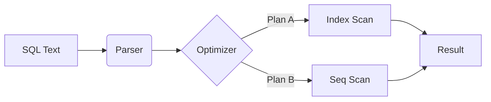

# The Anatomy of a Query

Before we optimize, we must speak the language. SQL is declarative—you tell the engine *what* you want, not *how* to get it.

## The Basic Pattern

Every query follows a specific lexical order. However, the database executes them in a completely different logical order.

!!! note "The Mental Model"
    Imagine you are ordering a pizza. You don't tell the chef "Open the fridge, get cheese, grate it." You say "I want a Pepperoni Pizza."
    
    SQL is the menu order. The **Query Optimizer** is the Chef.

### Comparing Dialects

While standard SQL is universal, the implementation details differ.

=== "PostgreSQL (Row Store)"

    Postgres is strict. It requires explicit casting often.

    ```sql
    -- Standard PostgreSQL
    SELECT 
        product_id, 
        price * 1.08 AS price_with_tax
    FROM products
    WHERE created_at > '2023-01-01'::timestamp; -- Explicit cast
    ```

=== "DuckDB (Column Store)"

    DuckDB is pragmatic. It infers types aggressively to help analysts work faster.

    ```sql
    -- DuckDB Syntax
    SELECT 
        product_id, 
        price * 1.08 AS price_with_tax
    FROM products
    WHERE created_at > '2023-01-01'; -- Auto-inferred string to timestamp
    ```

## Internals: What happens when you hit Enter?

1.  **Parser:** Checks your spelling.
2.  **Planner:** Decides if it should use an Index or scan the whole table.
3.  **Executor:** Retrieves the actual 8kb pages from the disk.

