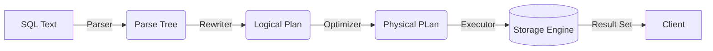

# Chapter 1: Hello, Data (Your First Query)
Welcome to the machine room. Before we start building data lakes or optimizing distributed compute, we need to understand the atomic unit of our work: **the query**.

You've typed `SELECT` a thousand times. But have you ever stopped to task the engine how it actually feels about that? In this chapter, we aren't just retrieving data; we are tearing apart the request cycle to see where the CPU cycles go.

## 1.1 The "Select Star" Pattern (Anatomy of a Query)
The `SELECT *` pattern is the "Hello, world!" of SQL. It is also the "delete production" of SQL. If you aren't careful.

When you send a query string to a database, you aren't talking to the data. You are talking to a **compiler**. The engine doesn't just "run" your text; it transforms it through several state changes before a single byte of data is read from disk.

### The Query Lifecycle

!!! note "The Mental Model: The Restaurant Kitchen"
    Think of the database engine as a high-end kitchen.
    
    1. **The Parser (The Waiter)**: Takes your order ("I want a burger"). It checks if "burger" exists on the menu (Syntax/Catalog check).
    2. **The Planner (The Chef)**: Decides *how* to make it. "Should I grill the patty first? Do I have pickles?" (Cost-based optimization).
    3. **The Executor (The Line Cook)**: Actually chops the onions and flips the meat.
    4. **The Storage Engine (The Fridge)**: Where the raw ingredients live.



### The Cost of "Star"
When you ask for `SELECT *`, you are asking for a full tuple (row). This behaves radically differently depending on whether your database is a **row store** (Postgres) or a **column store** (DuckDB).

=== "Postgres (Row Store)"
    In a row store, data is written to disk sequentially by row.

    ```sql
    -- The Query
    SELECT * FROM users LIMIT 5;
    ```

    **What Happened Internally?**
    Postgres loves this. It goes to a "page" (usually 8 KB) on the disk (the heap), find the offset for the row, and grabs the whole contiguous block of bytes. It's like pulling a book off a shelf; you get all the page (columns) at once.

    **The Cost:** Minimal CPU overhead to reconstruct the row.

=== "DuckDB (Column Store)"
    In a column store, every column is stored in a separate file or vector.

    ```sql
    -- The Query
    SELECT * FROM users LIMIT 5;
    ```

    **What Happens Internally?**
    DuckDB hates this (mildly). To give you "Row 1", it has to go to the `id` vector, then the `name` vector, then the `email` vector, and stitch them all together into a tuple to send back to you. This is called **materialization**.

    **The Cost**: High memory/CPU overhead for wide tables. You are forcing a column store to act like a row store.

!!! warning "The Trap: I/O Death Spiral"
    If you run `SELECT *` on a table with 500 columns in a column store (like Snowflake, Redshfit, or DuckDB), you aren't just reading data; you are seeking 500 different vectors on disk. If that data is in S3, you just triggered 500 HTTP GET requests.

    **Always select only what you need.**

## 1.2 Selecting Specific Columns (Projection)
In database theory, choosing specific columns is called **projection** (represented by $\pi$ in relational algebra). This is where modern data engineering stacks shine.

### The Physical Layout
To understand why projection matters, you have to visualize the disk.

[Visual Description for Excalidraw]

Draw two cylinders representing data storage. Cylinder A (Row Store): Sliced horizontally (like a salami). Each slice contains {ID, Name, Date}. Cylinder B (Column Store): Sliced vertically (like a bundle of straws). One straw is all IDs, the next straw is all Names.

When you run `SELECT price FROM orders`, the physical I/O path diverges completely.

=== "Postgres"
    ```sql
    SELECT price FROM orders;
    ```
    
    **The Mechanism:**
    Postgres still has to load the **entire page** containing the row into memory (the Buffer Pool). Even if you only want the `price` column, the engine reads the `id`, `customer_id`, and `metadata` columns into RAM, effectively throwing them away.

    It is wasteful on I/O bandwidth.

=== "DuckDB"
    ```sql
    SELECT price FROM orders;
    ```

    **The Mechanism:**
    DuckDB goes straight to the `price` vector. It ignores the `id` and `customer_id` vectors entirely. If your table is 1 TB but the `price` column is only 500 MB.  DuckDB only reads 500 MB.

    This is why column stores dominate analytics. We call this **ID pruning**.

### Aliasing & Vectorized Math
Data rarely comes in the format we need. We usually need to rename it (**aliasing**) or *modify* it (**expressions**).

```sql
SELECT
    price_cents,
    (price_cents / 100.0) AS price_dollars -- Math + Alias
FROM items;
```

This looks simple, but the execution model is the difference between a Scooter and a Ferrari.

!!! abstract "Deep Dive: Vectorization vs. Tuple-at-a-Time"
    How does the engine calculate `price / 100`?

    - **Postgres (Tuple-at-a-time)**: It loads Row 1, passes it to an interpreter, calculates the value, and returns it. Then it loads Row 2. It's a `for` loop running inside the CPU.
    - **DuckDB (Vectorization)**: It loads a chunk of 2,048 prices into a CPU register. It then uses **SIMD** (Single Instruction, Multiple Data) instructions to divide *all of them* by 100 in a single CPU cycle.

    It doesn't calculate `price[0] / 100`. It calculates `[price[0]...price[2048]] / 100`.

### The "Pro" Workflow
When working with modern tools (dbt, Polars, DuckDB), use Aliasing to decouple your "Logical Plan" (how you think about the data) from the "Physical Plan" (how the database stored it).

```sql
SELECT
    -- Rename technical debt away immediately.
    u_id AS user_id,

    -- Fix types early.
    -- If you don't cast, integer division will bite you.
    CAST(revenue AS DOUBLE) / 100 AS revenue_dollars
FROM raw_data;
```

!!! tip "Pro Tip: The Trailing Comma"
    Modern SQL dialects (DuckDB, Postgres 16+, BigQuery) allow trailing commas.

    ```sql
    SELECT
        col_a,
        col_b, -- <-- This is now legal and encouraged.
    FROM table;
    ```

    Why? Because it makes `git diff` cleaner when you add or remove columns later. Use it.

### Next Steps
Now that we know how to fetch data without blowing up the I/O budget, we need to talk about how we find *specific* rows. In Chapter 2, we will look at **filtering**, where we will learn why `WHERE` clauses are the most powerful optimization tool in your belt. 