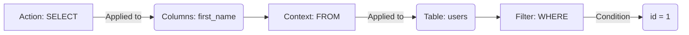
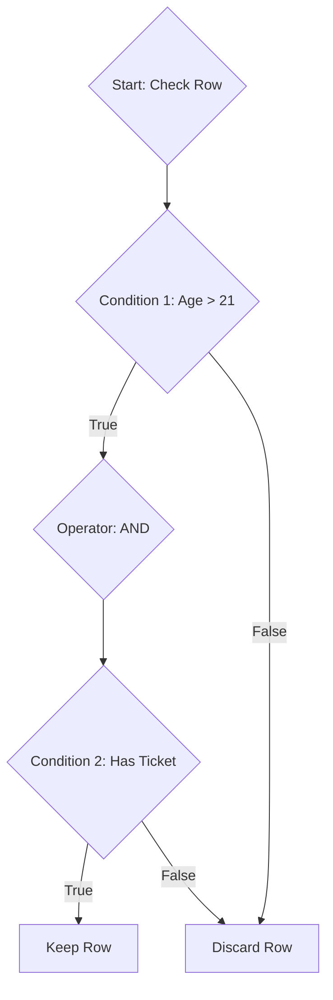

If Chapter 1 was about architecture, Chapter 2 is about grammar.

SQL (Structured Query Language) is unique among programming languages. It doesn't look like C, Python, or Java. It reads remarkably like English. IT is a **declarative language**, meaning you describe the result you want, and you trust the database engine to figure out the most efficient way to scavenge the data from the disk.

But don't let the English-like syntax fool you. SQL is rigorous. If you ask for the wrong thing, it will happily give you the wrong answer without generating a single error.

## 2.1 SQL Keywords
At its core, a SQL statement is built from **keywords** and **identifiers**.

- **Keywords** are vocabulary of the language (`SELECT`, `FROM`, `WHERE`, `INSERT`). They have special meaning to the database engine.
- **Identifiers** are the names you created: table *names* like `users`, column names like `email`.

### The "Shouting" Convention
SQL is technical **case-insensitive**. The database engine sees `select` and `SELECT` as the exact same command. However, for the last 40 years, a strong convention has survived:

!!! note "The Case for Caps"

    We write SQL keywords in **UPPERCASE** and identifiers in **snake_case**.

    Why? Because SQL code can get dense. Capitalization gives your eyes visual anchors.

    - **Good:** `SELECT first_name FROM users WHERE id = 1;`
    - **Bad:** `select first_name from users where id = 1;`
  
    In the first example, you can instantly distinguish the *actions* from the *objects*.

### The Grammar Structure
Most interactions with a database follow a Verb-Noun pattern. You pick an action (Keyword) and apply it to a target (Identifier).

### The Semicolon `;`
In many CLI (Command Line Interface) tools and scripts, the semicolon acts as the period at the ned of a sentence. It tells the database, "I am done talking; execute this now." If you forget it in a script with multiple commands, the database will try to read the next command as part of the first one, leading to confusing syntax errors.

## 2.2 Data Types
When you create a table, you are creating a contract. You promise the database that the data in a specific column will *always* look a certain way. This allows the database to optimize storage. If you know every value is an integer, you don't need the overhead of checking for text characters. 

Here are the fundamental types you will encounter in 90% of your work.

### Numeric Types
- `INTEGER` / `INT`: Whole numbers. Perfect for IDs, counts, and quantities.
- `DECIMAL` / `NUMERIC`: Exact fixed-point numbers.
- `FLOAT` / `DOUBLE`: Approximate floating-point numbers.

!!! warning "The Floating Point Trap"

    Never, ever use `FLOAT` for money. Floating-point math handles decimals by approximation (like how 1/3 is 0.333...). Over millions of transactions, these tiny rounding errors accumulate.

    Always use `DECIMAL` (or `MONEY` in some dialects) for concurrency. It stores values exactly, like a calculator.

### String Types
Strings are text. But in SQL, not all text is created equal.

- `CHAR(n)`: Fixed length. If you say `CHAR(10)` and store "Hi", the database pads it with 8 spaces to make sure it takes up the full size.
- `VARCHAR(n)`: Variable length. If you say `VARCHAR(10)` and store "Hi", it only uses enough spaces for "Hi" (plus a tiny byte to record the length).
- `TEXT`: Massive storage. Use this for blog posts or comments where the length is unpredictable.

### Date and Time
- `DATE`: YYYY-MM-DD
- `TIMESTAMP`: YYYY-MM-DD HH:MM:SS

!!! abstract "Timezones"

    Time is the hardest thing in computing. Does `12:00` mean noon in London or noon in Tokyo?

    Best practice: Store everything in UTC (Coordinated Universal Time) and only convert it to the user's local time when you display it on the screen.

### Boolean
- `BOOLEAN`: `TRUE` or `FALSE`

However, there is a ghost in the machine...

### The Null Value
`NULL` is not zero. `NULL` is not an empty string `''`. `NULL` represents the **absence of data**. It means "I don't know."

If you have a column for `middle_name`:
- `""` (Empty String) means "This person has no middle name."
- `NULL` means "We haven't asked this person for their middle name yet."

## 2.3 Operators
Operators are the symbols that let us perform logic and arithmetic within our queries.

### Comparison Operators
These are standard, with one famous exception.

| Symbol | Meaning | Example |
|--|--|--|
| `=` | Equal to | `WHERE age = 21` |
| `<>` or `!=` | Not equal to | `WHERE status <> 'banned'` |
| `>` | Greater than | `WHERE score > 100` |
| `<` | Less than | `WHERE price < 50` |
| `<=` | Less than/Equal | `WHERE price <= 50` |
| `>=` | Greater than /Equal | `WHERE price >= 50` |

!!! warning "Comparing NULLs"

    You cannot check if a value equals `NULL` using `= NULL`. Why? Because `NULL` is an unknown. Does "Unknown" equal "Unknown"? The database doesn't know!

    You must use the special operators `IS NULL` or `IS NOT NULL`.

### Logical Operators
We use these to combine multiple conditions.

1. `AND`: Both conditions must be true.
2. `OR`: At least one condition must be true.
3. `NOT`: Inverses the condition.

### Special Operators
SQL gives us syntactic sugar to make queries more readable.

 - `IN`: Checks if a value matches any value in a list.
     - *Clunky*: `WHERE city = 'Paris' OR city = 'London' OR city = 'Berlin'`
     - *Clean*: `WHERE city IN ('Paris', 'London', 'Berlin')`
 - `BETWEEN`: Selects values within a given range (inclusive).
     - *Usage*: `WHERE price BETWEEN 10 and 20`
 - `LIKE`: Pattern matching for strings. Use `%` as a wildcard.
     - `WHERE name LIKE 'A%'` matches "Adam", "Alice", "Arnold".
     - `WHERE name LIKE '%son'` matches "Jason", "Mason", "Bison".

## Quiz

<quiz>
The SQL database engine will trigger a syntax error if you write keywords (like `SELECT`) in lowercase letters.
- [ ] True
- [x] False 

</quiz>

<quiz>
Which data type is best described as a "Fixed Parking Lot" where every value takes up th exact same amount of storage space regardless o the actual text length?
- [ ] `VARCHAR`
- [ ] `STRING`
- [ ] `TEXT`
- [x] `CHAR`

</quiz>

<quiz>
Why is using the `FLOAT` data type considered a "trap" for storing monetary values?
- [x] It uses approximate floating-path math, leading to accumulation of rounding errors.
- [ ] It takes up too much storage space compared to `INTEGER`.
- [ ] It cannot handle negative numbers.
- [ ] It is not supported by most modern databases.

</quiz>

<quiz>
How does SQL define a `NULL` value?
- [ ] It represents a syntax error.
- [x] It represents the absence of data.
- [ ] It represents an empty string ("").
- [ ] It represents the number zero (0).

</quiz>

<quiz>
Which SQL snippet correctly selects rows where the `phone_number` column is empty (`NULL`)?
- [x] `WHERE phone_number IS NULL`
- [ ] `WHERE phone_number EQUALS NULL`
- [ ] `WHERE phone_number == NULL`
- [ ] `WHERE phone_number = NULL`

</quiz>

<quiz>
Which operator would you use to find all users whose names start with the letter 'J'?
- [x] `LIKE 'J%'`
- [ ] `EQUALS 'J*'`
- [ ] `IN ('J')`
- [ ] `BETWEEN 'J' AND 'K'`

</quiz>

<quiz>
You want to select users who live in "Paris", "London", or "Berlin". Which operator allows you to list these cities concisely without writing multiple 'OR' conditions?
- [ ] `BETWEEN`
- [ ] `AND`
- [ ] `LIKE`
- [x] `IN`

</quiz>

<quiz>
What is the primary function of the semicolon in SQL?
- [x] It acts as a terminator, telling the database 'Execute this command now.'
- [ ] It comments out the rest of the line.
- [ ] It is used to separate columns in a `SELECT` list.
- [ ] It defines a variable.

</quiz>

<quiz>
What is the recommended best practice for storing time in a database to avoid timezone confusion?
- [x] Store everything in UTC and convert to local time only when displaying.
- [ ] Store the time in the user's local timezone.
- [ ] Store the time as a string (`VARCHAR`).
- [ ] Store just the date and ignore the time component. 

</quiz>

<quiz>
The `BETWEEN` operator in SQL is inclusive, meaning it includes the start and end values in the result.
- [x] True
- [ ] False

</quiz>

<!-- mkdocs-quiz results -->

## Summary
In this part, we moved from the high-level architecture of databases to the specific syntax of SQL. We learned that while SQl looks like plain ENglish, it acts like a strict logical contract. In the next part of our journey we will start constructing our first real queries using various data manipulation and definition statements. 